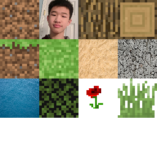

# MinecraftGL

A *work in progress* Minecraft clone made using Rust and opengGL

Note: I'm reworking the chunk generation system so trying to run this project as of now will likely result in crashes or just simply not running

# Features
  -
      - Work in progress greedy meshing  
      - Dynamic creation of texture atlases at runtime
      - 
      - Multithreaded chunk generation

 # Plans
   -
      - General cleanup of the chunk generation system code
      - Event based communication between the scene and renderer
      - Transparent blocks via sorting of mesh faces in particular chunks
      - Noisemap generation on a seperate thread to reduce chunk generation time
      - Dynamic biomes
      - Physics and a player model
      - GUI system utilizing the EGUI library
      - Interactable blocks such as chests, crafting tables, and furnaces
      - Defferred rendering pipeline for ambient occlusion, shadows, and dynamic light sources
      - Hostile and friendly mobs utilizing the entity component system
      
